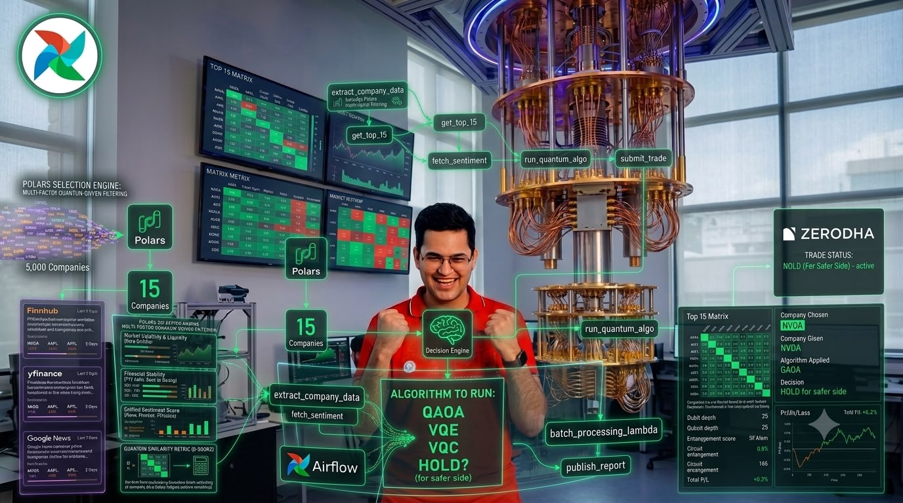
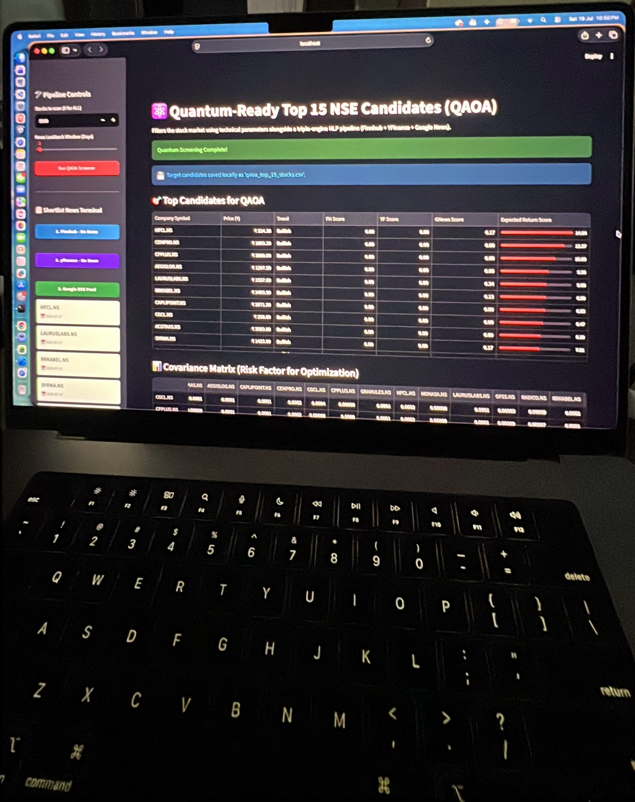

# 🌌 AI_DE_QC_ML_AR: Quantum-Enhanced Trading & Data Pipeline



## 📖 Project Overview
This repository hosts a state-of-the-art, multi-disciplinary pipeline at the intersection of **Artificial Intelligence, Data Engineering, Quantum Computing, Machine Learning, and Augmented Reality**. It is designed to extract data from 5000+ companies, run sentiment analysis across major financial news outlets, and leverage cutting-edge Quantum Algorithms to make risk-averse, automated trading decisions.

---

## 🚀 Core Architecture & Workflow

### 1. Data Engineering & ETL (Airflow & Polars)
*   **Mass Data Extraction:** Systematically tracks and evaluates 5000+ companies from the stock market.
*   **High-Speed Processing:** Utilizes **Polars** for lightning-fast DataFrame manipulations and transformations.
*   **NLP Sentiment Pipeline:** Extracts and analyzes the last 3 days of news data using a triple-engine news checker:
    *   📰 **Google News**
    *   📊 **Finnhub**
    *   📈 **Yahoo Finance**
*   **Orchestration:** **Apache Airflow** manages the robust ETL data pipelines, ensuring reliable daily execution.

### 2. Quantum Computing (IBM QC & Qiskit)
*   **Quantum Spin Up:** Leverages IBM Quantum backends via the **Qiskit** framework.
*   **Algorithmic Engine:** Applies advanced quantum algorithms for portfolio optimization, feature selection, and classification:
    *   ⚛️ **QAOA** (Quantum Approximate Optimization Algorithm)
    *   ⚛️ **VQE** (Variational Quantum Eigensolver)
    *   ⚛️ **VQC** (Variational Quantum Classifier)

### 3. Automated Trading & Decision Logic (Zerodha Kite)
*   **Broker Integration:** Seamlessly interacts with the **Zerodha Kite** API for executing money-based decisions.
*   **Risk Management Strategy:** The core algorithm operates on a strict, conservative principle: **"Hold on to be on the safer side"**. The quantum decision engine prefers safety in volatile share market conditions, minimizing drawdowns.

### 4. Augmented Reality (Unity C#) - *Optional*
*   An experimental AR module built with **Unity (C#)** designed to visualize multi-dimensional quantum states, risk covariance matrices, and real-time market data in an immersive environment.

---

## 📊 Dashboard & Interface


*The local pipeline interface highlighting the Quantum-Ready Top 15 NSE Candidates and Covariance Matrix calculations.*

---

## 🛠️ Installation & Setup

### Prerequisites
*   **Python 3.10+**
*   **Docker & Docker Compose** (Optimized for fast local execution, including tailored configurations for Apple Silicon / M1 Max architectures)
*   **Apache Airflow**
*   IBM Quantum API Token
*   Zerodha Kite API Credentials

### Quick Start
1. **Clone the repository:**
   ```bash
   git clone [https://github.com/yourusername/AI_DE_QC_ML_AR.git](https://github.com/yourusername/AI_DE_QC_ML_AR.git)
   cd AI_DE_QC_ML_AR


